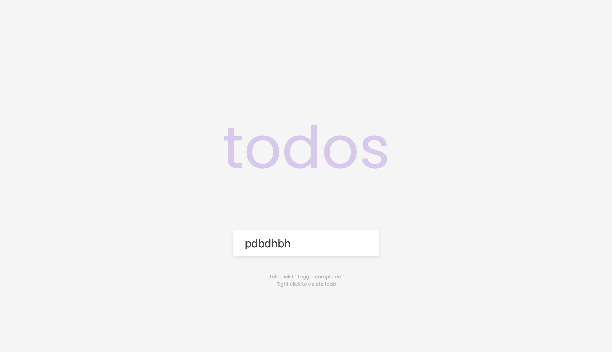

# JV Todos

> Simple ToDo website built with basic HTML, CSS, and JS.

## Features

- **Easy-to-Use:** Left-click to toggle completed, right-click to delete a todo.
- **Minimalistic Design:** Clean and straightforward interface.
## Demo

Check out the live demo: [JV Todos](https://jvtodos.netlify.app/)

## Usage

1. Open the website: [https://jvtodos.netlify.app/](https://jvtodos.netlify.app/)
2. Left-click on a todo to mark it as completed.
3. Right-click on a todo to delete it.

## Contributing

Contributions are welcome! If you have ideas for improvements or find any issues, please open an [issue](https://github.com/your-username/JVTodos/issues) or submit a [pull request](https://github.com/your-username/JVTodos/pulls).

## License

This project is open-source and available under the [MIT License](LICENSE).

## Acknowledgements

- Built with ❤️ by Joshua Varghese
- Hosted on [Netlify](https://www.netlify.com/)

